# Plots

Lumen provides a full suite of plots that help you understand the structure of your time series, evaluate model fit, and inspect forecast behavior.  These visualizations are generated through the `Plotter` class and can be saved automatically to a directory of your choice.

## Overview

Lumen's plotting system focuses on clarity and interpretabiliy.  Each plot highlights a specific aspect of the model:

- Trend, long-term movement,
- Seasonality, repeating patterns,
- Residuals, model fit and anomalies, 
- Forecast, future values with trend and seasonality,
- Strength metrics, variance explained by trend and seasonality, and 
- Continuity, smoothness at the forecast boundary.

Plots are optional but highly recommended for understanding model behavior.

## Using Plotter

To generate all plots at once:

```{python}
from lumen.plotter import Plotter

plotter = Plotter(save_dir="plots/")

plotter.plot_all(
    series=lumen.loader.get_series(),
    model=lumen.engine.model,
    forecast=lumen.forecast_df,
    future_index=lumen.engine.future_index_,
    diagnostics=lumen.diagnostics
)
```

This produces a set of png files in the specified directory.

## Plot Types

Below are the plots Lumen generates, with examples and interpretation guidance.

### Decomposition

Displays the actual series, the smoothed trend, and the fitted values.

**Interpretation**

- Trend is smooth (LOESS).
- Fitted values track the actual series closely.
- Difference between actual and fitted appear in residual plots.

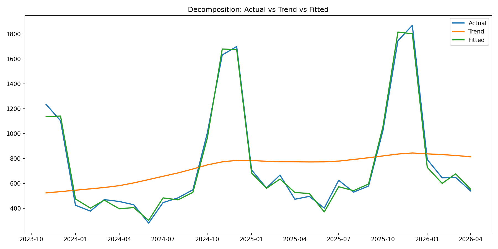

### Seasonal Cycle

Shows the repeating seasonal pattern over one full period.

**Interpretation**

- Values > 1 indicate above-trend periods.
- Values < 1 indicate below-trend periods.
- The shape should match domain expectations.

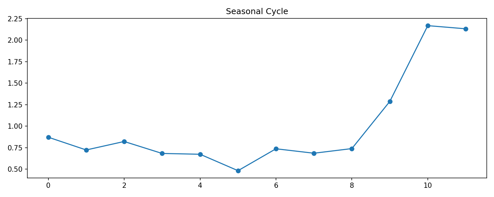

### Seasonal Factors Over Time

Shows the seasonal pattern repeated across the full series.

- Highlights how seasonality interacts with trend.
- Useful for spotting seasonal drift or irregularities.

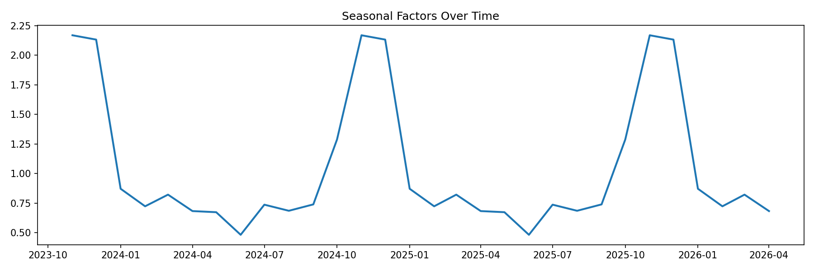

### Residuals Over Time

Shows multiplicative residuals relative to the fitted model.

**Interpretation**

- Residuals should hover around one.
- Large spikes may indicate anomalies.
- Patterns may suggest missing structure.

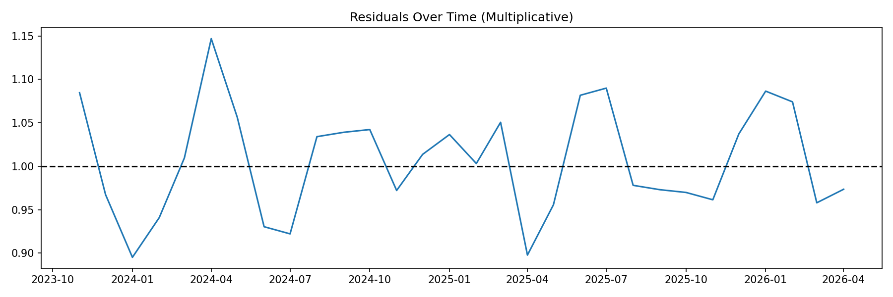

### Residual Distribution

Histogram of residual values.

**Interpretation**

- Should be centered near one.
- Tight distribution indicates good model fit.
- Skew or heavy tails may indicate anomalies.

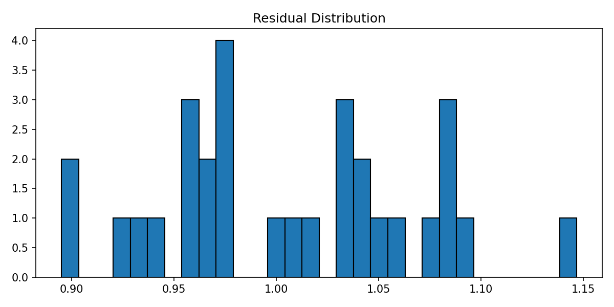

### Residual Z-Scores

Standardized residuals with anomaly thresholds.

**Interpretation**

- Values beyond +/-3 are potential anomalies.
- Cluster of high z-scores may indicate structural change.

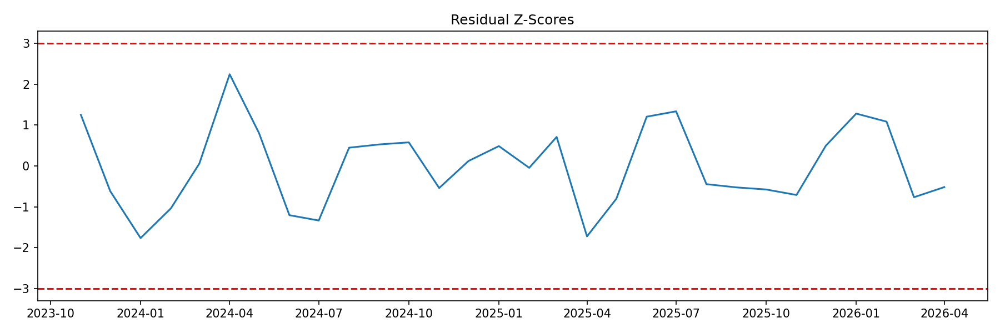

### Continuity

Compares the last historical value to the first forecast value.

**Interpretation**

- A smooth boundary indicates good alignment.
- A jump suggests a mismatch between trend and seasonality at the boundary.

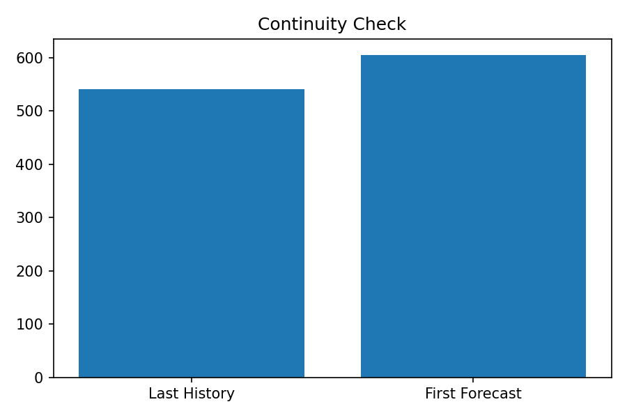

### Error Metrics

Shows MAE, RMSE, MAPE, and SMAPE.

**Interpretation**

- RMSE > MAE indicates larger errors are present.
- MAPE and SMAPE show relative error.
- Useful for comparing models.

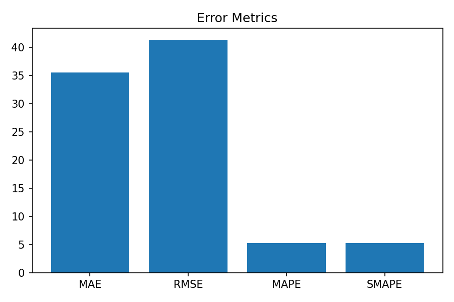

### Forecast vs Actual

Shows historical data, fitted values, and the forecast horizon.

**Interpretation**

- The blue line shows the actual series.
- The orange line shows the fitted values.
- Seasonal peaks and troughs should align with history.
- The forecast boundary should be smooth unless continuity issues exist.

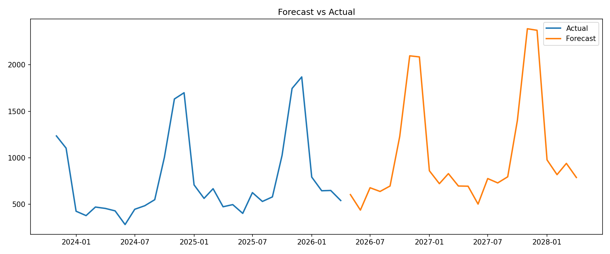

### Trend vs Seasonal Strength

Bar chart comparing strength metrics.

**Interpretation**

- Values near one indicate dominant components.
- Seasonal strength often dominates in strongly periodic data.

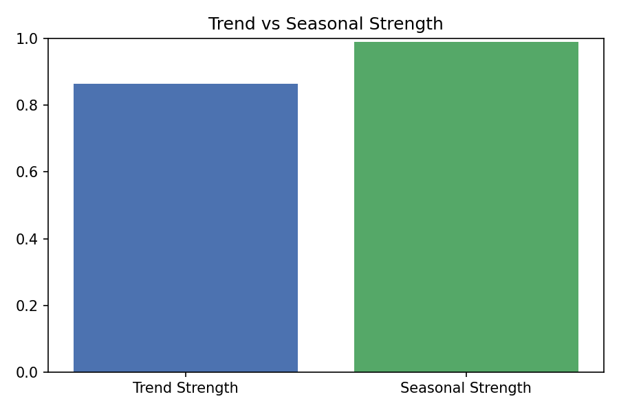

### Variance Contributions

Shows how much variance is explained by trend, seasonality, and residuals.

**Interpretation**

- Seasonality often contributes the most.
- Residual variance should be small.
- Trend variance indicates long-term structure.

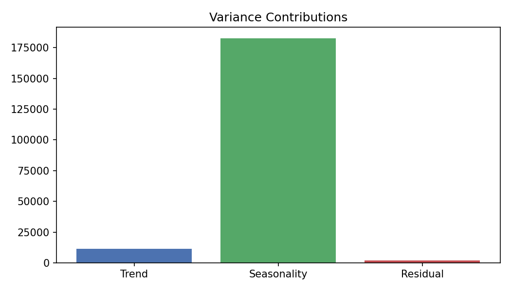
